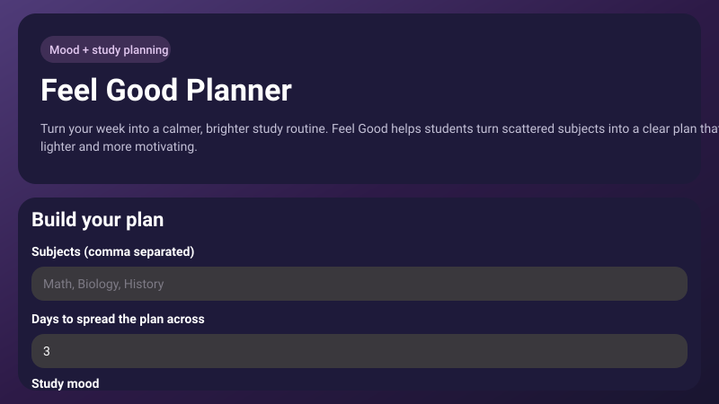
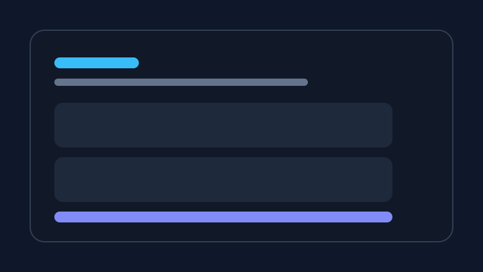
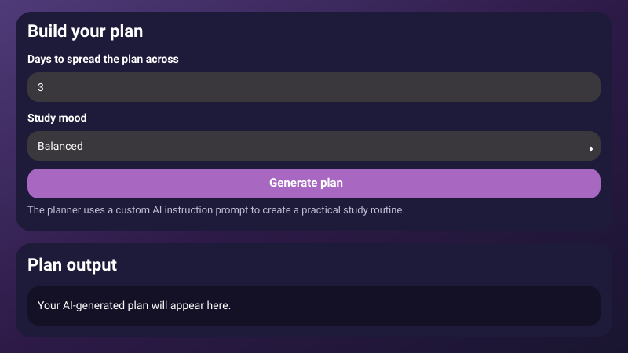

# Feel Good Planner

Feel Good Planner is a lightweight web app that helps students turn a chaotic week of courses into a calmer, more realistic study schedule. It is designed for students who juggle multiple classes, deadlines, and energy levels and need structure without extra friction.

## Live demo

Open the app here:
https://htmlpreview.github.io/?https://raw.githubusercontent.com/Nawab16/project/main/docs/index.html

## What problem it solves

Many students know they should study more consistently, but they struggle to turn their workload into a plan they can actually follow. FocusFlow helps by turning a few inputs into a simple weekly plan with clear focus areas.

## Features

- Simple form to enter subjects and study days
- Adjustable study mood for balanced, exam-prep, or light review modes
- Instant AI-style plan generation based on the student’s inputs
- Clean, responsive interface for desktop and mobile
- Lightweight backend that runs as a single Node.js server for local use

## AI feature

The app includes an AI-style planning feature that generates a study plan from user inputs. The underlying instruction is:

> Create a practical study plan for a student with multiple subjects. Keep the plan realistic, balanced, and easy to follow. Prioritize clarity over complexity and tailor the tone to the selected study mood.

## Tools and services used

- Node.js for the local server
- HTML, CSS, and vanilla JavaScript for the front end
- Node.js test runner for verification
- GitHub Pages for public deployment

## Screenshots







## How to run locally

1. Install Node.js 18+
2. Run:
   ```bash
   npm install
   npm start
   ```
3. Open http://localhost:3000

## Verification

The planner logic is tested locally with:

```bash
npm test
```
